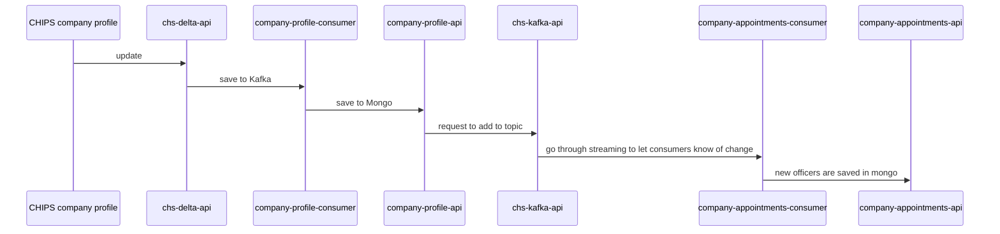

# Company Appointments Consumer

## Summary

* The company appointments consumer consumes messages from the stream-company-profile Kafka topic and deserialises them
using the ResourceChangeData avro schema.
* The messages are processed by sending PATCH requests to the Company Appointments API to update each appointment
for the changed company profiles.

## Context

## System requirements

* [Git](https://git-scm.com/downloads)
* [Java](http://www.oracle.com/technetwork/java/javase/downloads)
* [Maven](https://maven.apache.org/download.cgi)
* [MongoDB](https://www.mongodb.com/)
* [Apache Kafka](https://kafka.apache.org/)

## Building and Running Locally using Docker

1. Clone [Docker CHS Development](https://github.com/companieshouse/docker-chs-development) and follow the steps in the
   README.
2. Enable the following services using the command `./bin/chs-dev services enable <service>`.
   * company-appointments-consumer
   * chs-kafka-api
   * chs-streaming-api
3. Boot up the services' containers on docker using chs-dev `chs-dev up`.
4. Messages can be produced to the stream-company-profile using the instructions given in
[CHS Kafka API](https://github.com/companieshouse/chs-kafka-api).

## Environment variables

| Variable                                     | Description                                                                         | Example (from docker-chs-development)                        |
|----------------------------------------------|-------------------------------------------------------------------------------------|--------------------------------------------------------------|
| CHS_API_KEY                                  | The client ID of an API key with internal app privileges                            | abc123def456ghi789                                           |
| API_URL                                      | The URL which the Company Appointments API is hosted on                             | http://api.chs.local:4001                                    |
| SERVER_PORT                                  | The server port of this service                                                     | 9090                                                         |
| BOOTSTRAP_SERVER_URL                         | The URL to the kafka broker                                                         | kafka:9092                                                   |
| CONCURRENT_LISTENER_INSTANCES                | The number of listeners run in parallel for the consumer                            | 1                                                            |
| STREAM_COMPANY_PROFILE_TOPIC                 | The topic ID for stream company profile kafka topic                                 | stream-company-profile                                       |
| GROUP_ID                                     | The group ID for the services Kafka topics                                          | company-appointments-consumer                                |
| MAX_ATTEMPTS                                 | The number of times a message will be retried before being moved to the error topic | 5                                                            |
| BACKOFF_DELAY                                | The incremental time delay between message retries                                  | 100                                                          |
| STREAM_COMPANY_PROFILE_INVALID_MESSAGE_TOPIC | The full name of the stream company profile invalid topic                           | stream-company-profile-company-appointments-consumer-invalid |
| LOGLEVEL                                     | The level of log messages output to the logs                                        | debug                                                        |
| HUMAN_LOG                                    | A boolean value to enable more readable log messages                                | 1                                                            |

## Building the docker image

    mvn compile jib:dockerBuild -Dimage=169942020521.dkr.ecr.eu-west-1.amazonaws.com/local/company-appointments-consumer

## To make local changes

Development mode is available for this service
in [Docker CHS Development](https://github.com/companieshouse/docker-chs-development).

    ./bin/chs-dev development enable company-appointments-consumer

This will clone the company-appointments-consumer into the repositories folder. Any changes to the code, or resources will
automatically trigger a rebuild and relaunch.

## Makefile Changes
The jacoco exec file that SonarQube uses on GitHub is incomplete and, therefore, produces incorrect test coverage
reporting when code is pushed up to the repo. This is because the `analyse-pull-request` job runs when we push code to an open PR and this job runs `make test-unit`.
Therefore, the jacoco exec reporting only covers unit test coverage, not integration test coverage.

To remedy this, in the
short-term, we have decided to change the `make test-unit` command in the Makefile to run `mvn clean verify -Dskip.unit.tests=false -Dskip.integration.tests=false` instead as this
will ensure unit AND integration tests are run and that coverage is added to the jacoco reporting and, therefore, produce accurate SonarQube reporting on GitHub.

For a more in-depth explanation, please see: https://companieshouse.atlassian.net/wiki/spaces/TEAM4/pages/4357128294/DSND-1990+Tech+Debt+Spike+-+Fix+SonarQube+within+Pom+of+Projects
